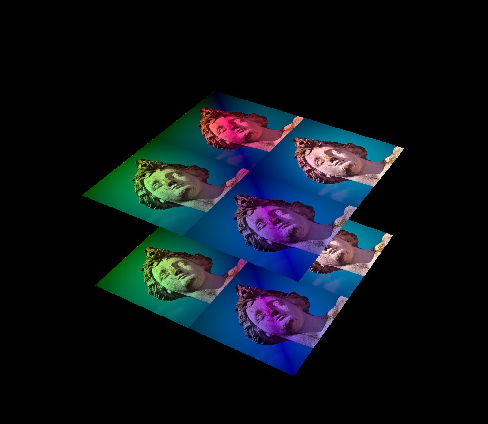

## Introduction

This is a cross-platform 3D Game Engine that utilizes the Vulkan Graphics API.
Using this project to learn as I go about everything related to graphics & low-level engine programming.

I've used lots of resources to learn Vulkan with C++ but left out a lot of the (frankly unnecessary) OOP-ness of common implementations.

I want this to be my engine, not to reinvent the wheel, but to write it for the sake of learning and write a simple game or two with it. It'll not only teach me about engine programming, but force me to use my own product, so to say.

### Concepts this project has taught me so far:
- building a graphical application ""from scratch""
- writing platform-agnostic code, no direct interface with WIN32/POSIX APIs
- debugging said code (currently via logging, raddbg and renderdoc)
- synchronization primitives (using fences & semaphores to sync GPU/CPU work)
- queue families, the swapchain & present modes
- vertex & index buffers, vertex & fragment shaders
- loading textures, texels, mipmaps

### State:
- there's a resizeable window
- it shows a rotating, coloured rectangle.

### Next up:
- finishing the vulkan-tutorial (texture mapping to go)
- camera control
- a GUI (imgui / clay)
- a default project.
- project management, custom filetype

### Plans:
- building an editor that's able to save & load models/projects
- learn and implement material shaders, compute shaders, etc
- create an API to write games with (no scripting, pure C/C++)
- provide API callbacks (like glfwSetFramebufferSizeCallback);
- add a wireframe view via hotkey
- anything else I'm motivated enough to implement, like for example:
    - replacing GLFW with my own cross-platform windowing implementation (Win32, macOS, X11, Wayland)
    - replacing stb with my own image parser
